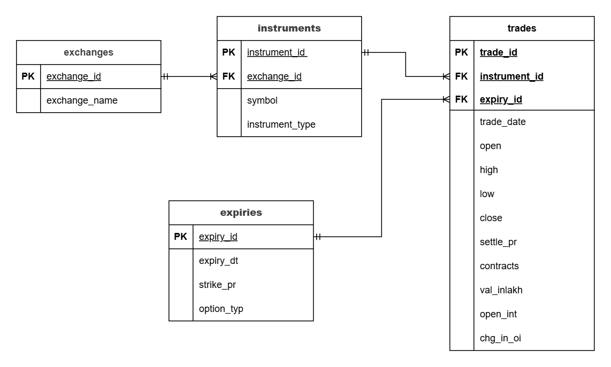

# F&O Market Data Analytics

## Overview

This project focuses on designing and implementing a relational database for high-volume Futures and Options (F&O) market data from Indian exchanges. The dataset contains around 2.5 million rows of NSE derivatives data covering three months of trading activity. The goal was to build a clean, normalized schema that supports efficient time-series queries and can scale to handle larger datasets and multiple exchanges.

The system is designed for trading analytics use cases such as open interest analysis, option chain summaries, volatility tracking, and cross-exchange comparisons.

---

## Tech Stack

- PostgreSQL 17
- Python (pandas, psycopg2)
- Jupyter Notebook
- Draw.io (ER Diagram)
- SQL (DDL + analytical queries)

---

## Dataset

- **Source:** [NSE Future and Options Dataset 3M – Kaggle](https://www.kaggle.com/datasets/sunnysai12345/nse-future-and-options-dataset-3m)
- **Size:** ~2.5 million rows
- **Period:** August – October 2019
- **Instruments:** FUTIDX, FUTSTK, OPTIDX, OPTSTK

> `3mfanddо.csv` is not committed due to file size. Download from the link above and place in `data/`.
> `sampledata.csv` (500 rows) is included for reference.

---

## Schema Design

Normalized schema (3NF) with four tables:

- **exchanges** – reference table for NSE, BSE, MCX
- **instruments** – unique (exchange, symbol, instrument_type) combinations
- **expiries** – expiry date, strike price, option type
- **trades** – main fact table with OHLC prices, contracts, open interest (2.5M+ rows)



See `docs/reasoning.pdf` for full design rationale.

---

## Design Decisions

- Normalized schema (3NF) to reduce redundancy and improve data consistency
- Avoided star schema to maintain clean ingestion and avoid duplication
- Separate expiries table to efficiently handle option chains where strike prices repeat across contracts
- Schema designed to support multi-exchange data (NSE, BSE, MCX) without structural changes

---

## Key Features

- Partitioned trades table using range partitioning on `trade_date`
- BRIN index on `trade_date` for efficient time-series filtering
- Composite index on `(instrument_id, trade_date)` for common query patterns
- Batch loading using `execute_values` with page size 10,000
- Multi-exchange ready — BSE and MCX seeded in exchanges table

---

## SQL Queries

| File                            | Description                                             |
| ------------------------------- | ------------------------------------------------------- |
| `03_top_oi_change.sql`        | Top 10 symbols by OI change across exchanges            |
| `04_rolling_volatility.sql`   | 7-day rolling std dev of close prices for NIFTY options |
| `05_cross_exchange.sql`       | Average settle price by exchange and instrument type    |
| `06_option_chain_summary.sql` | CE/PE volume side by side grouped by expiry and strike  |
| `07_max_volume_30d.sql`       | Max contracts per symbol in last 30 days using RANK()   |

Sample outputs for all queries are available in `sample_outputs/`.

---

## Performance Optimization

- Range partitioning on `trade_date` — queries scan only the relevant quarterly partition
- Composite index on `(instrument_id, trade_date)` significantly improved query performance for time-series filtering — served MAX(trade_date) with zero heap fetches
- BRIN index on `trade_date` — lightweight and effective for chronologically loaded data
- EXPLAIN ANALYZE output saved in `sample_outputs/explain_analyze.txt`
- Execution time on 2.5M rows with window functions: ~2 seconds

---

## Data Loading

Data was loaded using Python (pandas + psycopg2):

- Parsed date columns from source format
- Inserted instruments and expiries as lookup data first
- Mapped foreign keys before loading trades

One key challenge was mapping raw CSV fields to normalized tables — instruments and expiries had to be inserted first and their IDs fetched before trades could be loaded. Used batch inserts with `execute_values` for efficiency.

Full workflow in `notebook/data_loading.ipynb`.

---

## Project Structure

```
fno-market-data-analytics/
│
├── README.md
├── Problem_statement.docx
├── er_diagram/
│   └── er_diagram.drawio.png
├── data/
│   └── sampledata.csv
├── sql/
│   ├── 01_create_tables.sql
│   ├── 02_indexes.sql
│   ├── 03_top_oi_change.sql
│   ├── 04_rolling_volatility.sql
│   ├── 05_cross_exchange.sql
│   ├── 06_option_chain_summary.sql
│   └── 07_max_volume_30d.sql
├── notebook/
│   └── data_loading.ipynb
├── sample_outputs/
│   ├── op-03_top_oi_change.csv
│   ├── op-04_rolling_volatility-sample.csv
│   ├── op-05_cross_exchange.csv
│   ├── op-06_option_chain_summary.csv
│   ├── op-07_max_volume_30d.csv
│   └── explain_analyze.txt
└── docs/
    └── Reasoning.pdf
```

---

## How to Run -

1. Create the database:

```sql
CREATE DATABASE fno_db;
```

2. Run DDL scripts:

```bash
psql -U postgres -d fno_db -f sql/01_create_tables.sql
psql -U postgres -d fno_db -f sql/02_indexes.sql
```

3. Load data — open and run all cells in:

```
notebook/data_loading.ipynb
```

4. Run queries:

```bash
psql -U postgres -d fno_db -f sql/03_top_oi_change.sql
```

---

## Notes

This project demonstrates database design, SQL querying, and performance optimization for financial time-series data. The schema is built to support multi-exchange ingestion and higher-frequency datasets with minimal changes, making it suitable for real-world trading analytics systems.

---

*Thank you for visiting..*
